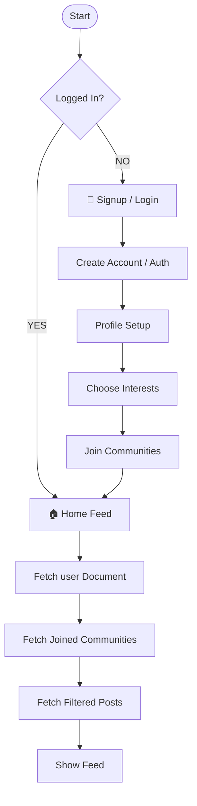

# 📱 OpenAudience - Complete App Flow & Architecture (MVP)

This document outlines the end-to-end data and navigation flow for the **OpenAudience Native Application**.

---

## 🧠 1. Authenticated Routing Flow

---

## 🏠 2. Home Feed Flow
1. **Screen Opens**: Gets `currentUserId` from Auth Context.
2. **Fetch Subscriptions**: Identifies `joinedCommunities` array from current user's profile document inside Firestore.
3. **Filter Posts**: 
   - Uses `.where('communityName', 'in', joinedCommunities)` filter query on `posts` collection.
4. **Display Layout**: Renders clean Feed items ordered reverse-chronologically sorting setup.
5. **Realtime Updates**: Sets up active snapshot listener triggers automatically pushing layout adjustments.

---

## 🔍 3. Discover Flow
1. **Trending Communities**: Fetches most popular categories ordered by `membersCount` desc accurately layout.
2. **Action triggers**: User taps **JOIN / JOINED** button toggle.
3. **Save to State Database**: 
   - Updates `users` Document `.joinedCommunities` appending or removing string array pointers directly triggers snapshot.
4. **Automated Sub-Update**: Increments `membersCount` field weight smoothly layout offsets.

---

## ➕ 4. Create Post Flow
1. User clicks **`+` Action Button** Floating row overlay.
2. Modal opens with **Community Scoped dropdown** selection framing.
3. Inputs captioned content with character validation headroom limit frames.
4. Option adds local photo libraries image picking trigger offset scale cleanly.
5. Action commits Firestore update appending item pointers instantly forcing state synchronization triggers.

---

## ❤️ 5. Engagement Loops (Likes / Comments)

### Like Loop Trigger
- User taps **Heart icon**.
- Client checks locally if already liked layout mapping securely.
- If not: Sets document in `posts.likes` with current ID triggers count write operations atomically `+1` increment.
- Resolves notifications updates overlay state synchronously layout.

### Comment Loop Trigger
- User expands Post thread row.
- Snapshot reads `.comments` sub-collection scoped ordered securely index.
- Saves document increments `commentsCount` value trigger nicely framing layout.

---

## 👥 6. Community Pages & Notification Screen

- **Community pages**: Filtered list explicitly scoping targeting `.where('communityName', '==', targetKey)` layout scaling securely framing correctly offsets.
- **Notifications Screen**: Connected snapshots targeting current user ID receiver node pointers triggers overheads state refresh responsibly.

---

> 🎯 **Core Lifecycle**: Discover → Join → Home Feed → Interact → Notification → Repeat.
